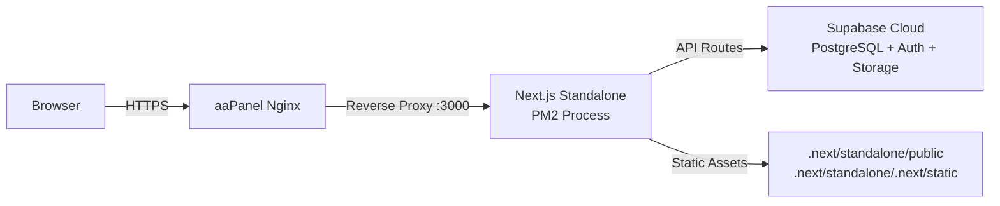

# 🚀 Salon Dashboard — Deployment Guide

**Target:** Ubuntu 24.04 LTS + aaPanel  
**Stack:** Next.js 16 (standalone) + Supabase Cloud  
**Repo:** `https://github.com/drjimmy1990/saloon-montaser.git`

---

## Prerequisites

| Requirement | Version |
|---|---|
| Ubuntu | 24.04 LTS |
| aaPanel | Latest |
| Node.js | 20+ (install via aaPanel → App Store → Node.js) |
| Git | Pre-installed on Ubuntu |
| PM2 | Process manager (installed below) |

---

## Step 1 — Server Preparation

SSH into your server and install the global tools:

```bash
# Install PM2 globally (process manager to keep the app alive)
npm install -g pm2
```

> [!TIP]
> If Node.js is not installed yet, go to **aaPanel → App Store → Runtime → Node.js Version Manager** and install Node.js 20 LTS.

---

## Step 2 — Clone the Repository

```bash
# Navigate to aaPanel's default website directory
cd /www/wwwroot

# Clone the repo
git clone https://github.com/drjimmy1990/saloon-montaser.git salon-dashboard

# Enter the project
cd salon-dashboard
```

---

## Step 3 — Create the Environment File

```bash
nano .env
```

Paste the following (replace values with your real credentials):

```env
# Supabase JS Configuration
NEXT_PUBLIC_SUPABASE_URL="https://vftatwykyypaisjmkcql.supabase.co"
NEXT_PUBLIC_SUPABASE_ANON_KEY="your-anon-key-here"
SUPABASE_SERVICE_ROLE_KEY="your-service-role-key-here"
```

Save and exit (`Ctrl+X`, then `Y`, then `Enter`).

> [!CAUTION]
> The `.env` file is **gitignored** and will NOT be in the repo. You **must** create it manually on the server. Never commit secrets.

---

## Step 4 — Install Dependencies & Build

```bash
# Install all dependencies
npm install

# Build the production bundle (standalone output)
npm run build
```

> [!NOTE]
> The project uses `output: "standalone"` in `next.config.ts`. After `npm run build`, Next.js generates a self-contained server at `.next/standalone/server.js` that includes only the required `node_modules`.

After the build completes, copy the static assets into the standalone folder:

```bash
# Copy public assets
cp -r public .next/standalone/public

# Copy static build output
cp -r .next/static .next/standalone/.next/static
```

---

## Step 5 — Start with PM2

```bash
# Start the app with PM2 on port 3000
PORT=3000 pm2 start .next/standalone/server.js --name "salon-dashboard"

# Save the PM2 process list so it auto-restarts on reboot
pm2 save

# Enable PM2 startup on boot
pm2 startup
```

Verify it's running:

```bash
pm2 status
# You should see "salon-dashboard" with status "online"

# Check logs if needed
pm2 logs salon-dashboard
```

> [!TIP]
> Useful PM2 commands:
> - `pm2 restart salon-dashboard` — Restart the app
> - `pm2 stop salon-dashboard` — Stop the app
> - `pm2 logs salon-dashboard --lines 50` — View last 50 log lines
> - `pm2 monit` — Live monitoring dashboard

---

## Step 6 — aaPanel Reverse Proxy Setup

### 6a. Create a Website in aaPanel

1. Go to **aaPanel → Website → Add Site**
2. Enter your domain name (e.g., `salon.yourdomain.com`)
3. Select **PHP Version: Static** (we don't need PHP)
4. Click **Submit**

### 6b. Configure SSL (HTTPS)

1. Click on the site name → **SSL**
2. Click **Let's Encrypt** → enter your domain → click **Apply**
3. Enable **Force HTTPS**

### 6c. Set Up Reverse Proxy

1. Click on the site name → **Reverse Proxy**
2. Click **Add Reverse Proxy**
3. Fill in:
   - **Proxy Name:** `salon-dashboard`
   - **Target URL:** `http://127.0.0.1:3000`
   - **Send Domain:** `$host`
4. Click **Submit**

### 6d. Add WebSocket Support (for Realtime)

Click **Configuration** on the reverse proxy you just created and replace with:

```nginx
location / {
    proxy_pass http://127.0.0.1:3000;
    proxy_set_header Host $host;
    proxy_set_header X-Real-IP $remote_addr;
    proxy_set_header X-Forwarded-For $proxy_add_x_forwarded_for;
    proxy_set_header X-Forwarded-Proto $scheme;
    proxy_set_header Upgrade $http_upgrade;
    proxy_set_header Connection "upgrade";
    proxy_http_version 1.1;
    proxy_read_timeout 86400s;
    proxy_send_timeout 86400s;
}
```

> [!IMPORTANT]
> The `Upgrade` and `Connection` headers are essential for Supabase Realtime subscriptions to work through the proxy.

---

## Step 7 — Set Up the Database (New Project)

If deploying to a **fresh Supabase project**, run the master schema:

1. Open **Supabase Dashboard → SQL Editor**
2. First enable the required extension:
   ```sql
   CREATE EXTENSION IF NOT EXISTS moddatetime;
   ```
3. Paste the full contents of `master-schema.sql` and run it
4. Then seed the system settings defaults:
   ```sql
   INSERT INTO public."SystemSetting" ("key", "value")
   VALUES
     ('business_name', 'صالون جاردينيا'),
     ('business_phone', '+970123456789'),
     ('business_email', 'info@gardenia.com'),
     ('currency', 'ILS')
   ON CONFLICT ("key") DO NOTHING;
   ```

---

## Step 8 — Configure RLS Policies

After deploying the schema, you need RLS policies so the app can read/write data. Run this in the SQL Editor:

```sql
-- Allow full access via service_role (used by API routes)
-- and read access for authenticated users

-- Generic policy for all tables (service_role bypass)
DO $$
DECLARE
  tbl TEXT;
BEGIN
  FOR tbl IN
    SELECT table_name FROM information_schema.tables
    WHERE table_schema = 'public' AND table_type = 'BASE TABLE'
  LOOP
    EXECUTE format('CREATE POLICY "Allow service_role full access" ON public.%I FOR ALL TO service_role USING (true) WITH CHECK (true)', tbl);
    EXECUTE format('CREATE POLICY "Allow anon read" ON public.%I FOR SELECT TO anon USING (true)', tbl);
    EXECUTE format('CREATE POLICY "Allow anon write" ON public.%I FOR ALL TO anon USING (true) WITH CHECK (true)', tbl);
  END LOOP;
END $$;
```

> [!WARNING]
> This gives broad access suitable for an internal admin dashboard. If this dashboard will be publicly accessible, **restrict the `anon` policies** and use proper auth.

---

## Step 9 — Verify Deployment

```bash
# Test locally on the server
curl -s -o /dev/null -w "%{http_code}" http://localhost:3000
# Should return: 200
```

Then visit your domain in a browser: `https://salon.yourdomain.com`

---

## Updating the App (Future Deployments)

```bash
cd /www/wwwroot/salon-dashboard

# Pull latest code
git pull origin main

# Install any new dependencies
npm install

# Rebuild
npm run build

# Copy static files again
cp -r public .next/standalone/public
cp -r .next/static .next/standalone/.next/static

# Restart PM2
pm2 restart salon-dashboard
```

You can create a shortcut script for this:

```bash
nano deploy.sh
```

```bash
#!/bin/bash
set -e
cd /www/wwwroot/salon-dashboard
echo "⏳ Pulling latest code..."
git pull origin main
echo "📦 Installing dependencies..."
npm install
echo "🔨 Building..."
npm run build
echo "📂 Copying static assets..."
cp -r public .next/standalone/public
cp -r .next/static .next/standalone/.next/static
echo "🔄 Restarting PM2..."
pm2 restart salon-dashboard
echo "✅ Deployment complete!"
```

```bash
chmod +x deploy.sh
# Run with: ./deploy.sh
```

---

## Troubleshooting

| Problem | Solution |
|---|---|
| **502 Bad Gateway** | Check `pm2 status` — the app may have crashed. Run `pm2 logs salon-dashboard` to see errors. |
| **Port conflict** | Change PORT in the PM2 start command: `PORT=3001 pm2 start ...` and update aaPanel proxy target. |
| **Build fails on server** | Ensure Node.js 20+ is installed. Run `node -v` to check. |
| **Blank page** | Check browser console. Usually missing `.env` variables. |
| **Static files 404** | You forgot to copy `public/` and `.next/static/` into `.next/standalone/`. Re-run the copy commands. |
| **Supabase connection errors** | Verify `.env` values are correct. Test with `curl` against your Supabase URL. |
| **PM2 not restarting on reboot** | Run `pm2 startup` and follow the printed command, then `pm2 save`. |

---

## Architecture Diagram



---

## File Reference

| File | Purpose |
|---|---|
| `master-schema.sql` | Full database schema — run on new Supabase projects |
| `dump-schema.js` | Script to re-dump schema from live DB |
| `.env` | Environment variables (create manually on server) |
| `next.config.ts` | `output: "standalone"` for self-contained deployments |
| `deploy.sh` | Quick-update script (create on server) |
